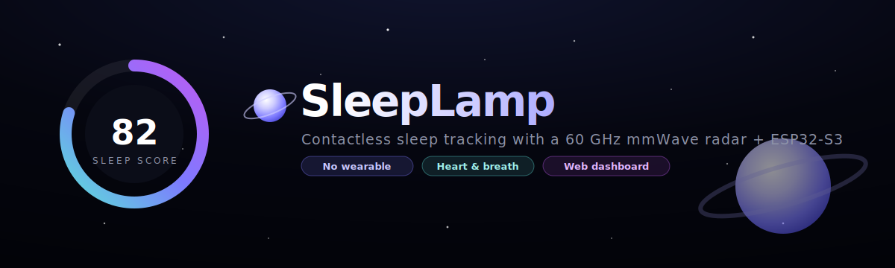
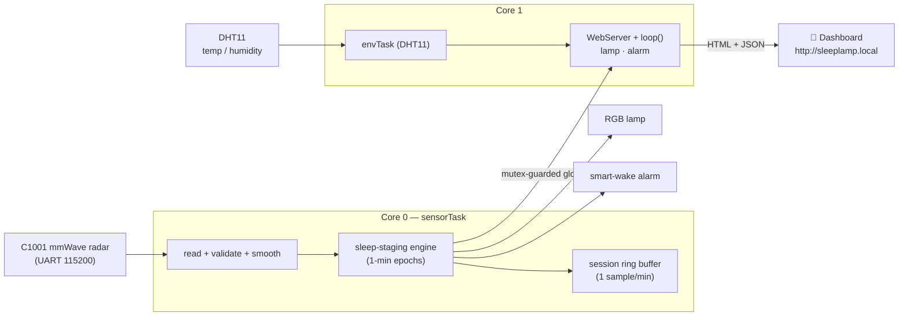
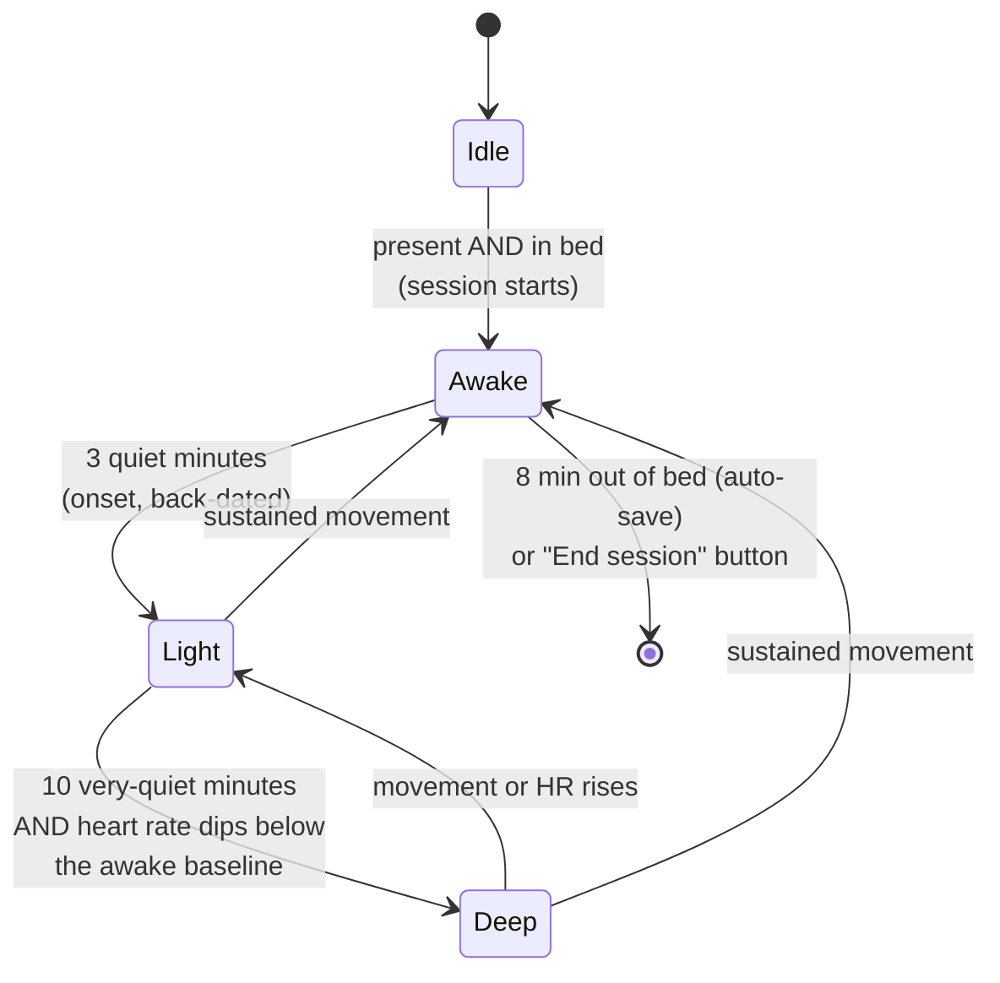
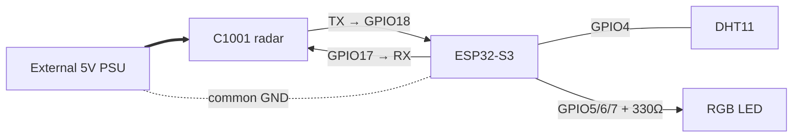

<h1 align="center">SleepLamp</h1>

<p align="center">
  <b>A bedside lamp that tracks your sleep without touching you.</b><br>
  60&nbsp;GHz mmWave radar + ESP32-S3 → sleep stages, heart rate, breathing, and a
  full web dashboard at <code>http://sleeplamp.local</code> — no wearable, no camera, no cloud.
</p>

<p align="center">
  
  
  
  
</p>

---

## Table of contents

- [What is SleepLamp?](#what-is-sleeplamp)
- [See it in action](#see-it-in-action)
- [Feature tour](#feature-tour) — *what each feature does*
- [How it works](#how-it-works) — *the teaching part: architecture & the algorithm*
- [Hardware & wiring](#hardware--wiring)
- [Build & flash it yourself](#build--flash-it-yourself)
- [Using the dashboard](#using-the-dashboard)
- [HTTP API reference](#http-api-reference)
- [Project structure](#project-structure)
- [Roadmap](#roadmap)
- [Credits & license](#credits--license)

---

## What is SleepLamp?

Most sleep trackers are watches or rings you have to wear and charge. **SleepLamp**
sits on your nightstand and watches you breathe — literally. A **60 GHz millimetre-wave
radar** (DFRobot C1001 / SEN0623) bounces a tiny radio signal off your chest and reads
the micro-movements of your **heartbeat and breathing** from up to ~1.5 m away. An
**ESP32-S3** turns that into live sleep stages, a nightly score, and a polished
"deep-space" web dashboard you open from any phone or laptop on your WiFi.

> **Inspiration:** this project benchmarks against the commercial *Sleepal AI Lamp*
> Kickstarter. SleepLamp is an independent, open-source build — not affiliated with it.

**Why it's interesting**

- **Truly contactless** — nothing to wear, charge, or remember.
- **Real biometrics** — heart rate (bpm) and respiration (rpm) from radar, not estimates.
- **Works on naps** — a custom on-device staging engine reports from minute one (the
  radar's own staging needs 15–20 min; see [How it works](#how-it-works)).
- **100% local** — the dashboard is served straight off the ESP32. No app, no account,
  nothing leaves your network.

---

## See it in action

> 📷 These pull from [`docs/images/`](docs/images/). They'll show as broken icons
> until you drop in real captures from your own lamp — see that folder's README.

| Dashboard & score | Sleep-stage hypnogram |
|---|---|
|  |  |

| Night report | History (per-session, deletable) |
|---|---|
|  |  |

---

## Feature tour

### 🌙 Contactless sleep staging
SleepLamp classifies every minute as **Awake · Light · Deep** using body movement and
vitals from the radar. A session starts automatically when you're present and in bed,
and ends when you get up. No button presses required.

### ❤️ Live vitals
Heart rate and breathing rate stream live, smoothed to kill radar jitter. The dashboard's
two dots literally **pulse at your measured rate** — the heart dot beats at your bpm, the
breath dot at your rpm.

### 📊 Interactive hypnogram
A clean Awake/Light/Deep timeline of the current night. **Hover or tap any bar** and it
tells you exactly when that stage started, when it ended, and how long it lasted
(e.g. *"Deep sleep · 02:14 – 02:46 · lasted 32m"*). Below it, chips show your per-stage
totals at a glance.

### 📝 Night report + smart insight
When a session ends, SleepLamp builds a full report: total sleep, efficiency, deep/light
split, awakenings, turnovers, average HR/respiration, apnea events, and a **0–99 sleep
score**. A rule-based coach adds one plain-English insight ("It took 38 min to fall
asleep — try winding down earlier").

### 🗂️ Organized history (each session deletable)
Every finished night is saved on the lamp's flash (last 60 kept). The History view shows
a stats strip (sessions, 7-night averages, best night), then a scannable list — each row
has a colored score badge, a *Today/Yesterday* tag, a one-line summary, and a
deep/light/awake composition bar. **Tap to expand for full detail and a per-session
delete button.** Download everything as CSV, or clear all.

### 💡 Adaptive circadian lamp
The built-in RGB lamp reacts to your sleep state automatically: **warm** while you're up,
**dim amber** when you're in bed but awake, **off** once you're asleep, and a low amber
**night-light** if you get up mid-sleep (a 3 a.m. bathroom trip). Or take manual control
with color presets and a brightness slider.

### ⏰ Smart-wake sunrise alarm
Set a wake time and a window (say 30 min). SleepLamp watches for **light sleep** inside
that window and starts a gradual **sunrise light ramp** to wake you gently at the easiest
moment — never yanking you out of deep sleep. Get out of bed and it stops itself.

### 🪐 "Deep-space universe" dashboard
A single self-contained page served from the ESP32: nebula glow, drifting starfields,
shooting stars, a ringed planet, glassmorphism cards, a glowing score ring, scroll
progress bar, toasts, and a back-to-top button. Installable as a PWA on your phone.

---

## How it works

### System architecture

Two FreeRTOS tasks run on the ESP32-S3's two cores so a slow or rebooting radar can
**never** freeze the web UI:



- **`sensorTask` (core 0)** owns the radar UART exclusively — init, recovery, and feeding
  the staging engine — so HTTP traffic never collides with sensor reads.
- **`loop()` + WebServer (core 1)** serve the dashboard and drive the lamp/alarm.
- Shared state lives in **mutex-guarded globals**, so the web layer always reads a
  consistent snapshot.

### The sleep-staging engine (the clever bit)

The C1001's *built-in* staging needs **15–20+ minutes** of in-bed data before it reports
anything, and its nightly-stats frame arrives only once per night — useless for naps, and
corrupt frames used to flood the history with junk (HR 2 bpm, apnea 56…). So SleepLamp
**stages sleep itself**, one minute at a time, from movement + vitals:



Each **1-minute epoch** is scored from:
- **mean movement** + how often movement *spikes* (as a % of the epoch, so the thresholds
  hold regardless of timing),
- **heart rate** vs a learned *awake-in-bed baseline* (deep sleep requires the HR to drop).

The **sleep score (1–99)** blends four factors:

| Weight | Factor | Target |
|:--:|---|---|
| 45% | Sleep efficiency (asleep ÷ in-bed) | high |
| 25% | Deep-sleep share | ~25% |
| 15% | Total duration | ~7 h |
| 15% | Few awakenings | fewer is better |

Sessions are written to history **only** by the engine at session end — never from raw
radar frames — which is why the junk-data problem is gone for good.

### Why a custom engine instead of the radar's?

| | Radar's built-in staging | SleepLamp engine |
|---|---|---|
| First result | after 15–20 min | from **minute 1** |
| Works for naps | ✗ | ✓ |
| Junk-frame proof | ✗ (HR 2 bpm, apnea 56) | ✓ (validated writes only) |
| On-demand report | ✗ (once/night) | ✓ ("End session" anytime) |

---

## Hardware & wiring

### Bill of materials

| Part | Notes |
|---|---|
| **ESP32-S3-WROOM-1 N16R8** dev board | 16 MB flash, 8 MB PSRAM. The brains. |
| **DFRobot C1001 / SEN0623** 60 GHz mmWave sensor | The contactless radar. |
| **DHT11** temp/humidity sensor | Bedroom climate (bit-banged, no library). |
| **Common-cathode RGB LED** (+ 3× ~330 Ω resistors) | The adaptive lamp. |
| **External 5 V supply** (≥1 A, clean) | **Required** — see the gotcha below. |

### Wiring

| From | Pin | To |
|---|:--:|---|
| C1001 **TX** | **GPIO 18** | ESP32-S3 RX |
| C1001 **RX** | **GPIO 17** | ESP32-S3 TX |
| C1001 **VCC** | — | **external 5 V** (not the board's USB 5 V) |
| C1001 **GND** | — | common ground |
| DHT11 **DATA** | **GPIO 4** | (VCC 3V3, GND) |
| RGB **R / G / B** | **GPIO 5 / 6 / 7** | via ~330 Ω each, common → GND |



### ⚠️ Critical gotcha — radar power & the HR lock

Heart rate and breathing **only** appear when **all** of these are true:
1. The person is **still**, chest **0.5–0.8 m** from and **facing** the sensor.
2. Breathing is slow and steady.
3. The radar has **clean external 5 V** — the board's USB 5 V rail is too noisy and
   causes *no HR lock + corrupt UART frames + brownout reboots*.

A few `init error, retrying` lines for the first ~10–15 s after power-on are **normal**
(the radar takes that long to boot). If a lock won't hold, hit **Recalibrate sensor** on
the dashboard or power-cycle the radar's 5 V.

---

## Build & flash it yourself

### 1. Install the toolchain
- **Arduino IDE 2.x**
- **esp32 board package 3.0.0+** (Boards Manager → "esp32" by Espressif)
- **No sensor library to install** — the radar driver is bundled with the sketch as a
  single file, [`firmware/sleeplamp/ShubhSensor.h`](firmware/sleeplamp/ShubhSensor.h).
  It's the DFRobot C1001 driver merged into one header and patched (non-blocking cached
  reads, crash fixes for corrupt frames). The sketch is fully self-contained.

### 2. Set your WiFi (kept off GitHub)
```bash
cd firmware/sleeplamp
cp secrets.example.h secrets.h      # then edit secrets.h with your WiFi
```
`secrets.h` is git-ignored, so your password never leaves your machine. *(Don't have it
handy? Skip this — flash anyway and set WiFi from the `SleepLamp-Setup` hotspot,
password `sleeplamp123`, at `http://192.168.4.1/wifi`.)*

### 3. Board settings (Arduino IDE → Tools)
| Setting | Value |
|---|---|
| Board | **ESP32S3 Dev Module** |
| Partition Scheme | **Huge APP (3 MB No OTA / 1 MB SPIFFS)** |
| PSRAM | Disabled (not needed yet — see [Roadmap](#roadmap)) |

### 4. Flash & open
Open `firmware/sleeplamp/sleeplamp.ino`, upload, then browse to
**http://sleeplamp.local**. On the very first run an RGB boot test cycles
**Red → Green → Blue** so you can verify your LED wiring.

> **Edits not reaching the chip?** Clear the IDE cache: delete
> `%LOCALAPPDATA%\arduino\sketches` and re-upload.

---

## Using the dashboard

Open **http://sleeplamp.local** on any device on the same WiFi.

- **Sleep score & current state** at the top, with live vitals.
- **Sleep Stages** — the interactive hypnogram (hover/tap the bars).
- **Tonight** — live session counters + an **End session & save report** button.
- **History** — expand any night for detail; delete sessions individually or clear all;
  **Download CSV**.
- **Lamp** — Auto / Manual / Off, color presets, brightness.
- **Smart Wake** — set time + light-sleep window.
- **Device & Setup** — placement check, change WiFi, OTA firmware update, factory reset.

**Check Placement** is the handy onboarding tool — it walks you through getting all four
green checks (presence → still → breathing → heart rate) so you find the sweet spot.

---

## HTTP API reference

Everything the dashboard uses is a plain HTTP endpoint you can curl or script:

| Endpoint | Purpose |
|---|---|
| `GET /api/data` | Live JSON snapshot (vitals, state, live session, last report) |
| `GET /api/session` | Tonight's per-minute stage/HR/breath arrays (the hypnogram) |
| `GET /api/history` | All saved sessions (JSON array, oldest first) |
| `GET /api/history?del=N&t=STAMP` | Delete one session (index + timestamp guard) |
| `GET /api/history?clear=1` | Delete all sessions |
| `GET /api/export` | Download `sleeplamp_history.csv` |
| `GET /api/report?end=1` | End the current session now and save its report |
| `GET /api/light?mode=&r=&g=&b=&bright=` | Control the lamp |
| `GET /api/alarm?en=&h=&m=&win=` | Configure the smart-wake alarm |
| `GET /api/sensor?reset=1` | Recalibrate the radar |

---

## Project structure

```
SleepLamp_Project/
├─ README.md                  ← this file
├─ LICENSE                    ← MIT
├─ docs/                      ← banner + screenshots
├─ research/                  ← deep-dive notes (sensor, product analysis, architecture/BOM)
├─ datasheets/                ← C1001/SEN0623 reference
└─ firmware/
   ├─ sleeplamp/              ← ★ the product firmware (open sleeplamp.ino)
   │  ├─ sleeplamp.ino        ← globals, setup(), loop(), telemetry
   │  ├─ config.h             ← pins, engine constants, history cap, version
   │  ├─ secrets.example.h    ← copy → secrets.h (git-ignored) for WiFi
   │  ├─ types.h              ← shared data model + globals
   │  ├─ Sleep.ino            ← the sleep-staging engine
   │  ├─ Sensor.ino           ← C1001 radar task (core 0) + session recorder
   │  ├─ Env.ino              ← DHT11 task (core 1)
   │  ├─ Light.ino            ← adaptive RGB lamp + sunrise
   │  ├─ Alarm.ino            ← NTP time + smart-wake alarm
   │  ├─ Store.ino            ← history (save / list / delete / export)
   │  ├─ WebUI.ino            ← HTTP handlers + live JSON
   │  ├─ Settings.ino         ← persist lamp/alarm in NVS
   │  ├─ Provision.ino        ← WiFi portal, OTA update, factory reset
   │  ├─ page.h               ← the entire dashboard (HTML/CSS/JS, served from flash)
   │  └─ ShubhSensor.h        ← bundled single-file C1001 radar driver (no install needed)
   ├─ sleeplamp_core/         ← minimal serial-only vitals reader (sensor bring-up)
   ├─ c1001_s3_test/          ← minimal S3 vitals test
   ├─ c1001_uart_diag/        ← raw UART frame sniffer
   └─ c1001_demo/             ← classic ESP32 basics demo
```

---

## Roadmap

- [ ] **Snore detection** — I²S MEMS mic + a small TensorFlow Lite Micro model
      *(this is the feature that will finally justify turning on the S3's PSRAM)*.
- [ ] Ambient light sensor (BH1750) for smarter auto-brightness.
- [ ] Native mobile app + optional cloud sync.
- [ ] Matter support (needs esp32 core 3.1+).
- [ ] Finished 3D-printed enclosure.

---

## Credits & license

- **Radar driver:** `ShubhSensor.h` — the C1001 driver merged into a single file and
  patched (non-blocking cached reads + corrupt-frame crash fixes) by **Shubh Jaiswal**.
  It is built on DFRobot's [DFRobot_HumanDetection](https://github.com/DFRobot/DFRobot_HumanDetection)
  library (© 2010 DFRobot, MIT) — original copyright retained as the license requires.
- **Sensor:** DFRobot C1001 / SEN0623 —
  [wiki](https://wiki.dfrobot.com/SKU_SEN0623_C1001_mmWave_Human_Detection_Sensor).
- Built with the Arduino-ESP32 core.

This project's own code is released under the **[MIT License](LICENSE)**. Inspired by the
*Sleepal AI Lamp*; independent and unaffiliated.
